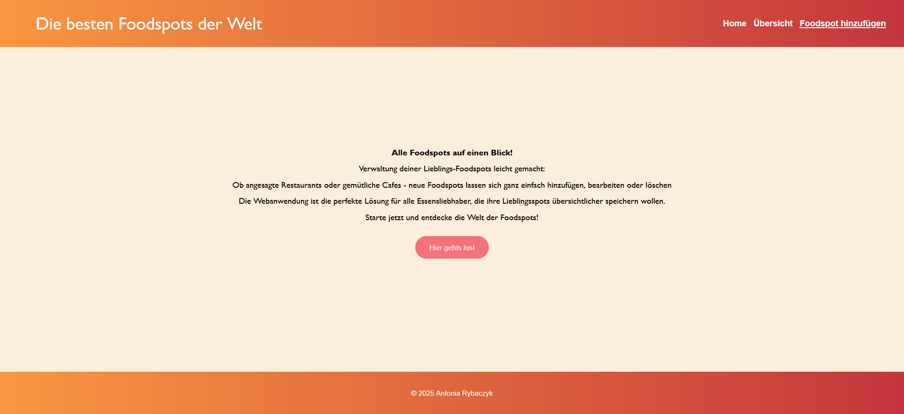
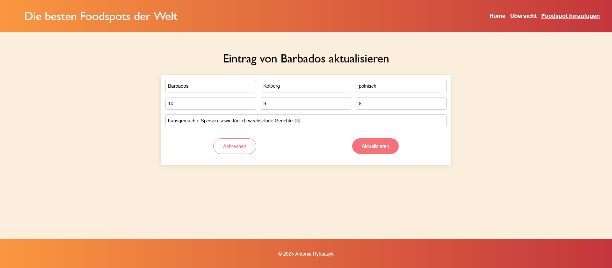
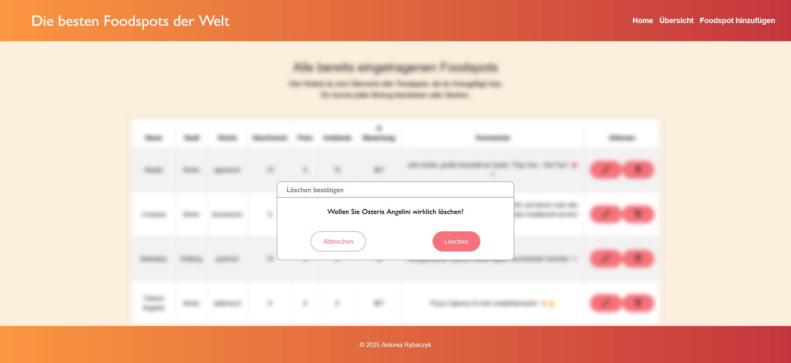

## Semesteraufgabe Webanwendung
# Foodspots – Die besten Foodspots der Welt

__Allgemeine Infos:__
Diese Webanwendung dient zur __Verwaltung von Foodspots__ - deine liebsten kulinarischen Entdeckungen auf einen Blick.
Es lassen sich neue Foodspots hinzufügen, bestehende bearbeitet oder löschen. 
Auf diese Weise bleibt die persönliche Sammlung gastronomischer Highlights stets übersichtlich und aktuell.

Die Anwendung besteht aus einem __Angular-Frontend__, einem __Node.js-Backend__ und verwendet eine __MongoDB-Datenbank__ zur Speicherung der Daten.

__Aufbau nach Navigationsbar:__
+ Home - Startseite

+ Übersicht - Übersicht aller bereits gespeicherten Foodspots in einer Tabelle

- Bearbeiten - Ausgewählten Foodspot bearbeiten 
+ Foodspots hinzufügen - Formular zum einfügen eines neuen Foodspots (Name, Stadt, Küche, Geschmack, Preis, Ambiente, Kommentar)

__Funktionen:__
+ Foodspot hinzufügen
+ Foodspot auslesen
+ Foodspot bearbeiten

+ Foodspot löschen

__Verwendete KI-Werkzeuge:__
+ Chat GBT -> Fehlermeldungen
+ Copilot VSC -> Korrierierung
+ ChatKI HTW -> README

   Favicon: https://favicon.io/emoji-favicons/fork-and-knife/
   
