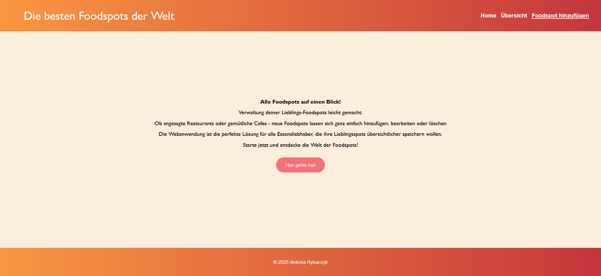
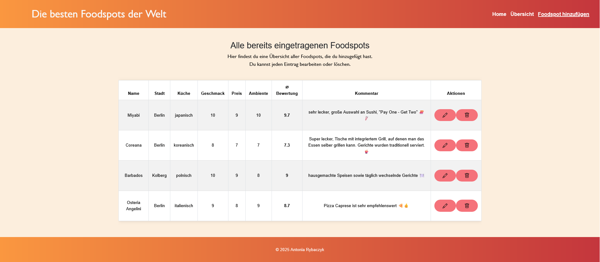
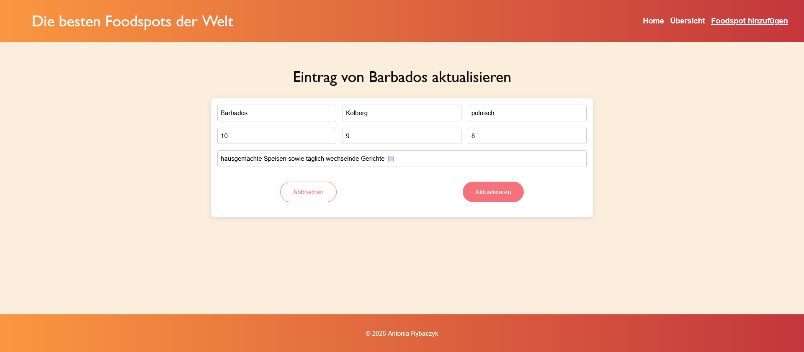
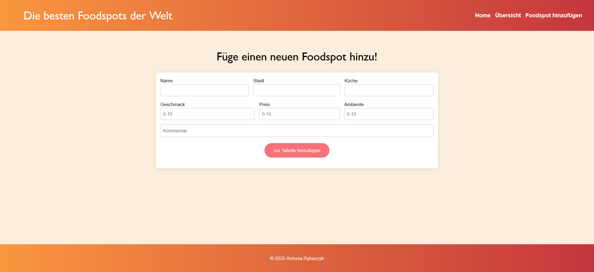
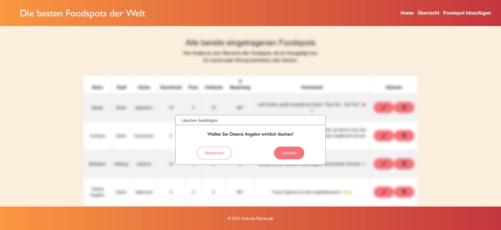

## Semesteraufgabe Webtechnologien 2025 - Webanwendung
# 🍴 Foodspots – Die besten Foodspots der Welt 🍴

## __✨ Allgemeine Infos__
Diese Webanwendung dient zur __Verwaltung von Foodspots__ - deine liebsten kulinarischen Entdeckungen auf einen Blick.
Es lassen sich neue Foodspots hinzufügen, bestehende bearbeitet oder löschen. 
Auf diese Weise bleibt die persönliche Sammlung gastronomischer Highlights stets übersichtlich und aktuell.

Die Anwendung besteht aus einem __Angular-Frontend__, einem __Node.js-Backend__ und verwendet eine __MongoDB-Datenbank__ zur Speicherung der Daten.

_Favicon: https://favicon.io/emoji-favicons/fork-and-knife/_
   

## __⚡ Aufbau nach Navigationsbar__
- 🏠 Home - Startseite  


- 🔎 Übersicht - Übersicht aller bereits gespeicherten Foodspots in einer Tabelle  


- ✏️ Bearbeiten - Ausgewählten Foodspot bearbeiten 
 

- ➕ Foodspots hinzufügen - Formular zum einfügen eines neuen Foodspots (Name, Stadt, Küche, Geschmack, Preis, Ambiente, Kommentar)
 


## __🔧 Funktionen__
- ➕ Foodspot hinzufügen  

- 🔎 Foodspot auslesen  

- ✏️ Foodspot bearbeiten  


- 🗑️ Foodspot löschen  


## __🔄 Installation__

**☝🏻 Voraussetzungen**

Folgende Tools sollten bereits instaliert sein:
+ Angular (für Frontend)
+ Node.js (für Backend)
+ MongoDB (Compass oder Atlas)

## 🔗 Repository klonen
- Frontend: https://github.com/krakersiq/foodspots_frontend.git
- Backend: https://github.com/krakersiq/foodspots_backend.git

## 💻 Frontend Einrichtung
Frontend starten mit 
```ng serve```


## 🔙🔚 Backend Einrichtung
Backend starten mit 
```node --watch server.js ```

## __🤖 Verwendete KI-Werkzeuge:__
+ Chat GBT -> Fehlermeldungen
+ Copilot VSC -> Korrierierung
+ ChatKI HTW -> README

### 👩🏻‍💻 Autorin
***Antonia Rybaczyk***