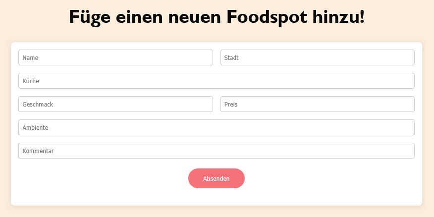

*Semesteraufgabe Webanwendung*
Foodspots – Die besten Foodspots der Welt

Diese Webanwendung dient zur Verwaltung von Foodspots - deine liebsten kulinarischen Entdeckungen auf einen Blick.
Es lassen sich neue Foodspots hinzufügen, bestehende bearbeitet oder löschen. 
Auf diese Weise bleibt die persönliche Sammlung gastronomischer Highlights stets übersichtlich und aktuell.
Die Anwendung besteht aus einem Angular-Frontend, einem Node.js-Backend und verwendet eine MongoDB-Datenbank zur Speicherung der Daten.

Aufbau nach Navigationsbar:
Home - Startseite
Alle Foodspots - Übersicht aller beriets gespiecherten Foodspots in einer Tabelle
Foodspots hinzufügen - Formular zum einfügen eines neuen Foodspots (Name, Stadt, Küche, Geschmack, Preis, Ambiente, Kommentar)

Login - (optional) Registrierung

Funktionen:
- Foodspot hinzufügen, bearbeiten und löschen
- Foodspots verwalten, filtern
- Lieblinge markieren???
- Filtern nach Bewertung???

Farbpalette:
#FCEEDD - Hintergrundfarbe
#fa9740, #c4363d - Header, Footer

Verwendete KI-Werkzeuge:
    # Frontend: Fehlermeldungen fixen
    # Backend: 
    # Chat GBT 
    # Copilot VSC

   Favicon: https://favicon.io/emoji-favicons/fork-and-knife/
   
