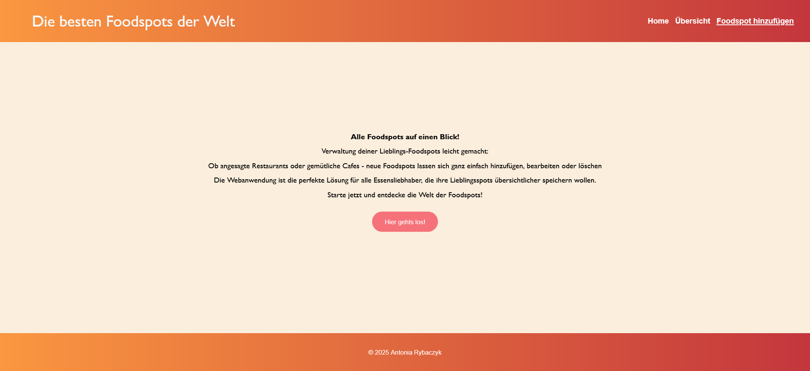
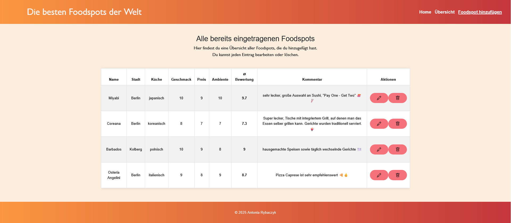
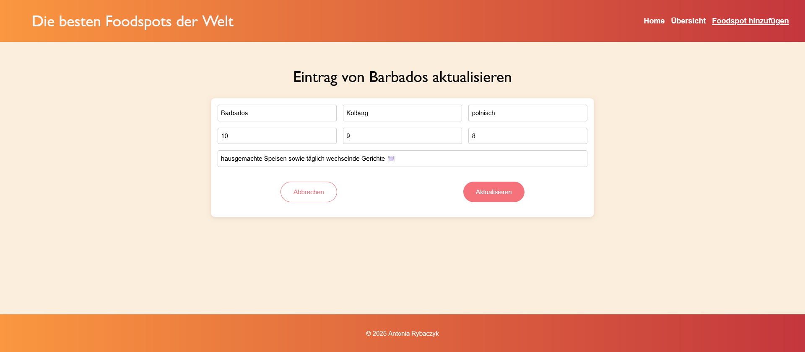
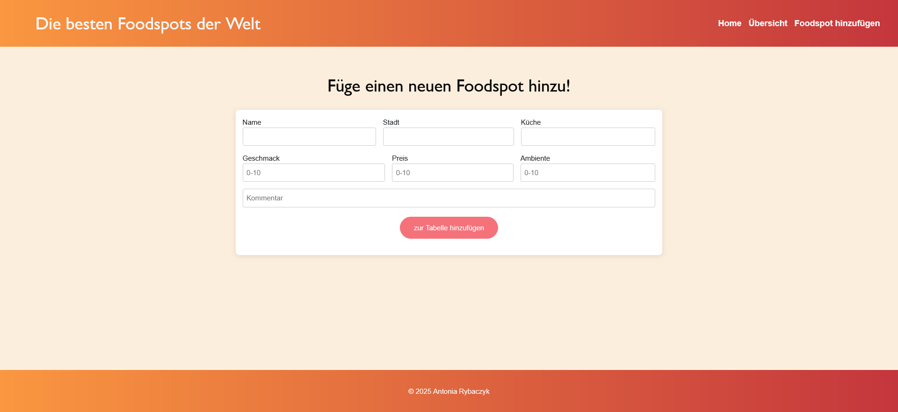
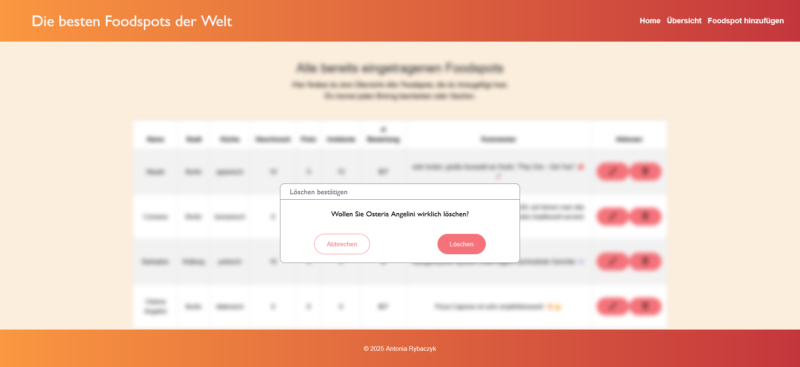

## Semesteraufgabe Webtechnologien 2025 - Webanwendung
# 🍴 Foodspots – Die besten Foodspots der Welt 🍴

## __✨ Allgemeine Infos__
Diese Webanwendung dient zur **Verwaltung von Foodspots** - deine liebsten kulinarischen Entdeckungen auf einen Blick.
Es lassen sich neue Foodspots hinzufügen, bestehende bearbeitet oder löschen. 
Auf diese Weise bleibt die persönliche Sammlung gastronomischer Highlights stets übersichtlich und aktuell.

### 🚀 Live-Demo
Das Frontend der Anwendung ist auf Vercel deployed und unter folgendem Link erreichbar:
👉 **[Foodspots Live-Anwendung](https://foodspots-fr.vercel.app)** 

> **⚠️ Hinweis zum Backend:** Da das Backend aktuell noch lokal läuft, zeigt die Live-Demo im Browser leere Listen oder Fehlermeldungen bei Datenbank-Aktionen. 
Um die volle Funktionalität zu testen, muss das Backend lokal gemäß der untenstehenden Anleitung gestartet werden.

Die Anwendung besteht aus einem **Angular-Frontend**, einem **Node.js-Backend** und verwendet eine **MongoDB-Datenbank** zur Speicherung der Daten.

_Favicon: https://favicon.io/emoji-favicons/fork-and-knife/_
   

## __⚡ Aufbau nach Navigationsbar__
- 🏠 Home - Startseite  


- 🔎 Übersicht - Übersicht aller bereits gespeicherten Foodspots in einer Tabelle  


- ✏️ Bearbeiten - Ausgewählten Foodspot bearbeiten 
 

- ➕ Foodspots hinzufügen - Formular zum einfügen eines neuen Foodspots (Name, Stadt, Küche, Geschmack, Preis, Ambiente, Kommentar)
 


## __🔧 Funktionen__
- ➕ Foodspot hinzufügen  
- 🔎 Foodspot auslesen  
- ✏️ Foodspot bearbeiten/aktualisieren


- 🗑️ Foodspot löschen  


# __🔄 Installation__

## ☝🏻 Voraussetzungen

Folgende Tools sollten bereits installiert sein:
+ Angular (für Frontend)
+ Node.js (für Backend)
+ MongoDB (Compass oder Atlas)

## 🔗 Repository klonen
+ Frontend
```git clone https://github.com/krakersiq/foodspots_frontend.git ```
+ Backend
```git clone https://github.com/krakersiq/foodspots_backend.git ```

## 💻 Frontend Einrichtung
```
cd foodspots_frontend
npm install
ng serve
```

## 🔙🔚 Backend Einrichtung
```
cd foodspots_backend
npm install
node --watch server.js
```

## 🤖 Verwendete KI-Werkzeuge
+ Chat GPT -> Unterstützung bei Fehlermeldungen
+ Copilot VSC -> Korrigierung, teilweise auch Code vervollständigt
+ ChatKI HTW -> Unterstützung bei README

## 🚀 künftige Erweiterungen
+ Registrierung
+ Login
+ Suchfunktion und Filter - nach Stadt, Küche, Bewertung und Preis
+ Foodspots als Favoriten markieren
+ Tags hinzufügen

## 👩🏻‍💻 Autorin
Antonia Rybaczyk
